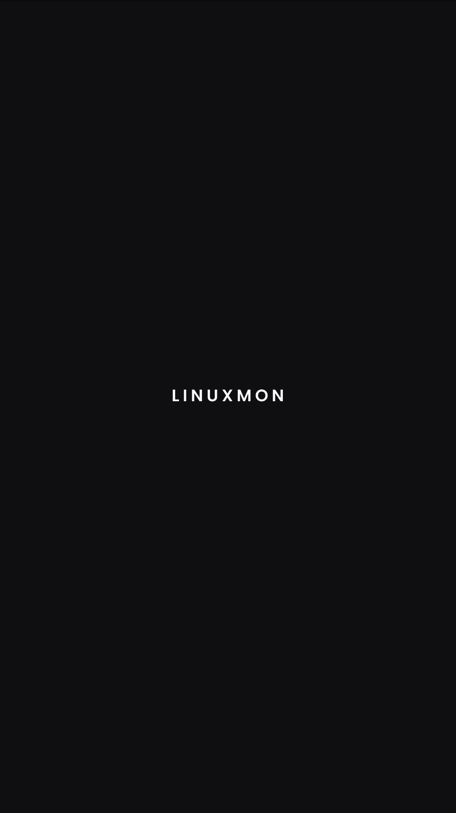
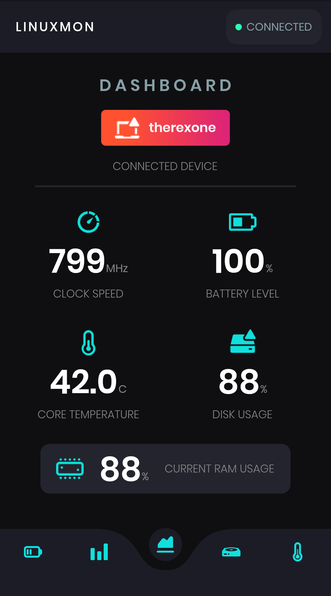
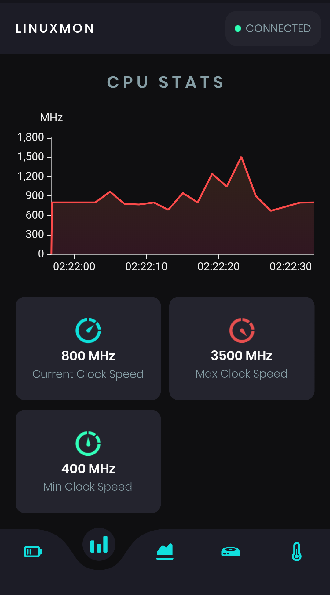
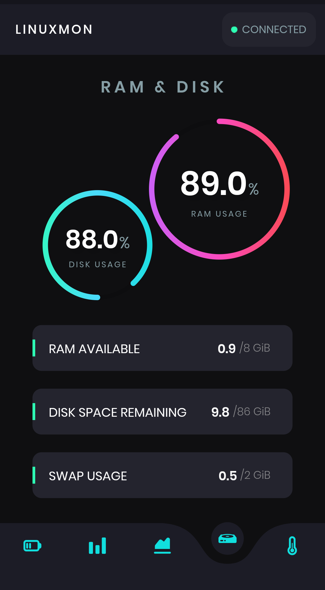
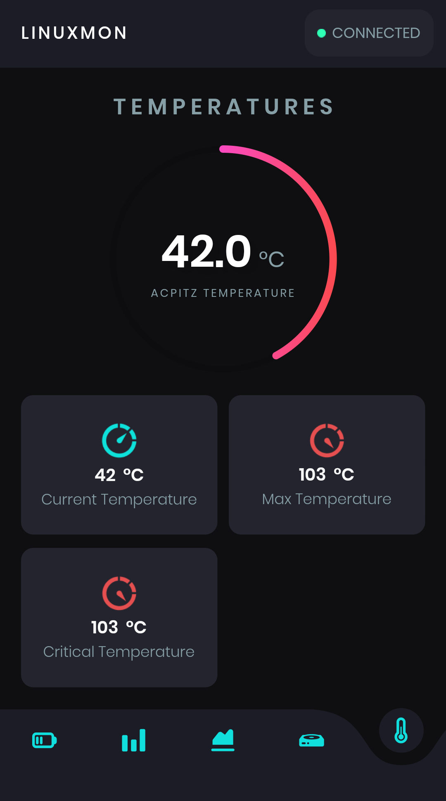
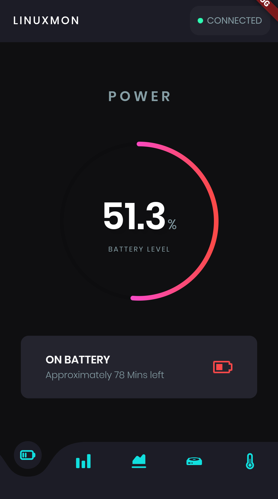
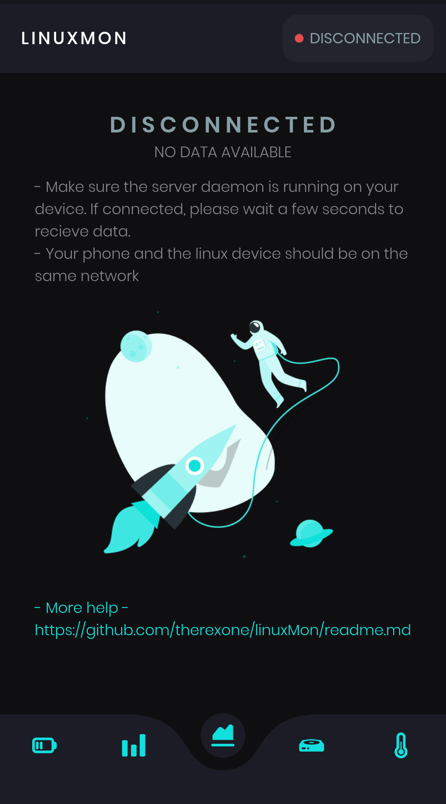

# LINUXMON
An app to monitor linux PC stats such as CPU, Battery, RAM etc. on your phone.

 &nbsp;&nbsp;&nbsp;&nbsp;  &nbsp;&nbsp;&nbsp;&nbsp;  &nbsp;&nbsp;&nbsp;&nbsp; 
&nbsp;&nbsp;&nbsp;&nbsp;
 &nbsp;&nbsp;&nbsp;&nbsp;  &nbsp;&nbsp;&nbsp;&nbsp;  &nbsp;&nbsp;&nbsp;&nbsp; 

# Installation
**Install the server on your linux PC**

- [Download](https://github.com/therexone/linux-mon/) the server executable
- Start the server 
```
./linux-dae-mon
```
*For other ways to run the server see [scripts/README.md](https://github.com/)*

- [Download](https://github.com/therexone/linux-mon/releases/download/v1.0.0-alpha%2B1/app-release.apk) and Install the app

**The phone and the Linux PC need to be on the same network to connect**

The app will search for a server and connect automatically.


